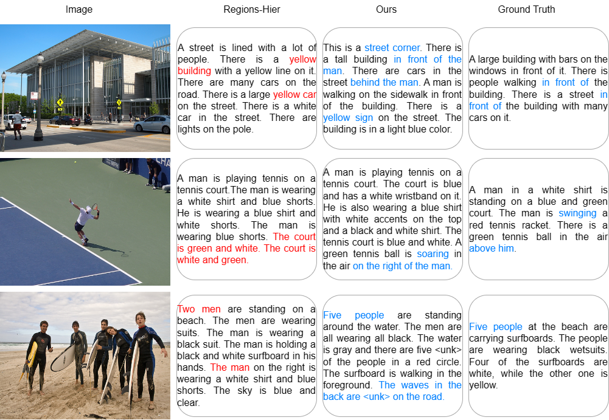

# paraCap
Code is coming soon.

## Model Performance

We listed the generated paragraphs of Regions-Hier and our model in the figure above. The blue parts in ground-truth paragraph are image details. The blue parts in generated paragraphs represent the consistency with the image details, while the red parts represent misunderstanding.

For the first image, the Regions-Hier model misunderstands the yellow sign as a building, and there are also issues with the understanding of the car. However, our model not only successfully describes the color of the sign, but also explains its understanding of the image such as **"This is a street corner"**. In terms of sentence order, the most salient building is first described, followed by the man, the yellow sign and cars in front of the building, which is closer to human linguistic habits. The transition between sentence is very natural, making the coherence significantly enhanced. 

For the second image, there is an immediate repetition of the sentences generated by Regions-Hier. On the contrary, our model even uses the image-specific word **'soaring'** in the description, which further reflects its deeper understanding of the scene. 

For the third image, the baseline model make an error in identifying the number of characters, and mistakenly describes the woman wearing blue clothes as a man. However, our model accurately describes the number of individuals and points out that **'The men are all wearing all black'**. Meanwhile, the paragraph first depicts of the main objects in the *foreground*, followed by the waves in the *background*, which is more in line with the human language habit of describing the foreground first, and the background subsequently. 

Overall, the proposed model significantly improves the coherence and readability of caption paragraph.
